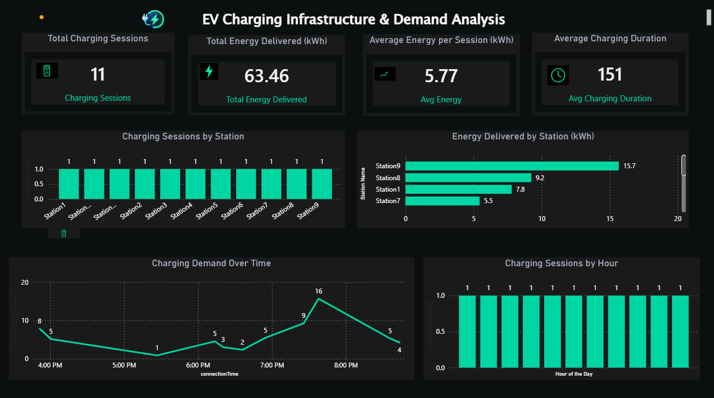

# ⚡ EV Charging Infrastructure & Demand Analysis

## 📌 Project Overview

An end-to-end **Data Analytics project** focused on analyzing EV charging sessions to understand energy consumption, charging duration, station-level usage, and charging demand patterns.

## 🛠️ Tools & Technologies

- **Python**
- **Pandas**
- **PostgreSQL**
- **SQL**
- **Power BI**

## 🔄 Project Workflow

**Data → Python/Pandas → Data Cleaning → Feature Engineering → PostgreSQL → SQL Analysis → Power BI Dashboard**

## 📊 Dashboard Preview



## 📈 Dashboard KPIs

The Power BI dashboard currently presents:

- **Total Charging Sessions:** 11
- **Total Energy Delivered:** 63.46 kWh
- **Average Energy per Session:** 5.77 kWh
- **Average Charging Duration:** 151 minutes

## 🔎 Analysis Included

- Charging sessions by station
- Energy delivered by station
- Charging demand over time
- Charging sessions by hour
- Station-level performance
- Energy consumption patterns
- Charging duration analysis

## 🧹 Data Preparation

Python and Pandas were used for:

- Inspecting the dataset
- Checking missing values
- Checking duplicate records
- Cleaning and preparing charging-session data
- Creating the `charging_duration_minutes` feature
- Exporting the cleaned dataset for database analysis

## 🗄️ SQL Analysis

The cleaned data was loaded into **PostgreSQL** and analyzed using SQL for:

- Session-level analysis
- Station demand
- Total and average energy consumption
- Average charging duration
- Station performance

## 📁 Project Structure

```text
EV-Charging-Infrastructure-Analysis/
│
├── README.md
├── dashboard.png
├── EV_Charging_Analysis.ipynb
├── EV_Charging_Dashboard.pbix
└── charging_sessions_clean.csv
```

## 💡 Project Objective

The objective is to demonstrate an end-to-end analytics workflow and use charging-session data to identify usage patterns that can support data-driven EV charging infrastructure analysis.

## 👩‍💻 Author

**Sarika**
